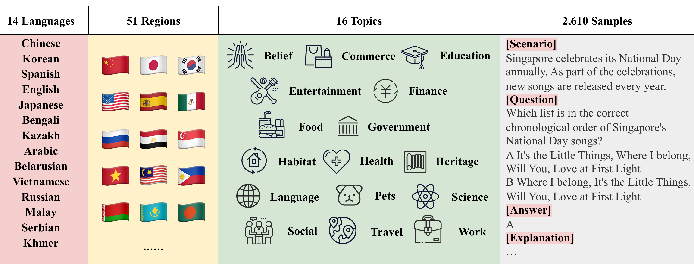
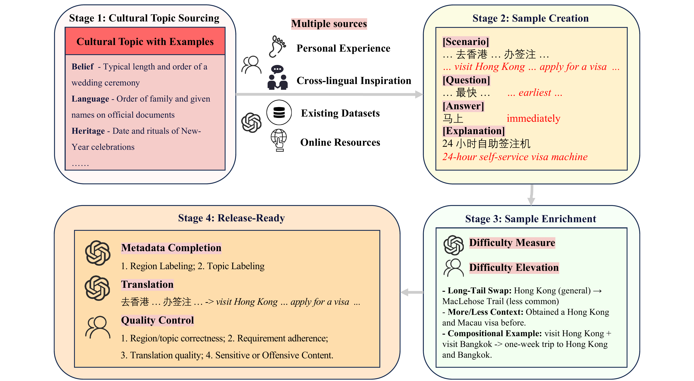
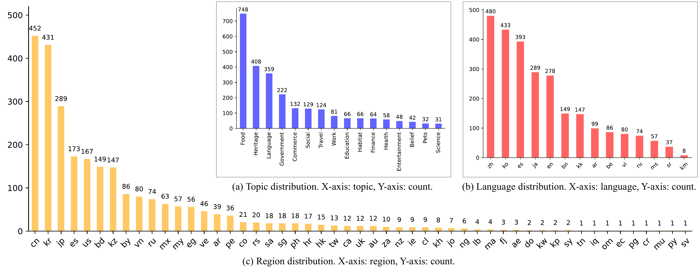

# CulturALL: Benchmarking Multilingual and Multicultural Competence of LLMs on Grounded Tasks

This repository contains the code and data for **CulturALL**, a comprehensive and challenging benchmark to assess LLMs' multilingual and multicultural competence on grounded tasks.

CulturALL contains **2,610 samples** in **14 languages** across **51 regions**, distributed among **16 topics** to capture the full breadth of grounded tasks. The best LLM achieves only **44.48% accuracy**, underscoring substantial room for improvement.

<p align="center">
  
</p>

Each item presents a grounded scenario followed by a question. Successfully solving each item requires an LLM to fuse contextual cues with its stored knowledge and reason to the correct answer.

## Key Features

- **Multilingual**: 14 languages — Chinese, English, Korean, Japanese, Spanish, Arabic, Russian, Bengali, Kazakh, Belarusian, Vietnamese, Malay, Serbian, Khmer
- **Multicultural**: 51 regions worldwide
- **Grounded**: Each item presents a real-world scenario requiring cultural knowledge and contextual reasoning
- **Challenging**: 55.17% of items are Hard (solved by ≤4 of 15 model settings)
- **16 Topics**: Belief, Commerce, Education, Entertainment, Finance, Food, Government, Habitat, Health, Heritage, Language, Pets, Science, Social, Travel, Work

## Data Construction Framework

CulturALL is built via a four-stage human–LLM collaborative framework:

<p align="center">
  
</p>

- **Stage 1 — Cultural Topic Sourcing**: Compile a comprehensive list of cultural topics with illustrative examples through human–LLM collaboration.
- **Stage 2 — Sample Creation**: Draft seed instances from multiple sources — personal experience, cross-lingual inspiration, existing datasets, and online resources.
- **Stage 3 — Sample Enrichment**: Elevate difficulty via long-tail swap, more/less context, and compositional examples. Filter using multi-model agreement.
- **Stage 4 — Release-Ready**: Complete metadata (region/topic labels), translate to English, and conduct quality control.

## Repository Structure

```
multi_culture_bench/
├── data/                              # Benchmark data
│   ├── cultural_topics.xlsx             # Cultural topic list (Stage 1 output)
│   ├── annotated_data.xlsx              # Full annotated dataset (2,610 samples)
│   ├── annotated_data_hard.xlsx         # Hard subset (eval_sum < 5)
│   ├── annotated_data_medium.xlsx       # Medium subset (5 ≤ eval_sum < 10)
│   └── annotated_data_easy.xlsx         # Easy subset (eval_sum ≥ 10)
│
├── utils/                             # Shared utilities
│   ├── llm_tool.py                      # Unified LLM API client (OpenAI, Anthropic, Gemini, Qwen, etc.)
│   ├── metadata_tool.py                 # Language/region/topic metadata & mappings
│   └── prompt_tool.py                   # Prompt templates for evaluation, translation, etc.
│
└── imgs/                              # Figures for README
    ├── Multi-Culture-Bench.png          # Benchmark overview
    ├── Pipeline.png                     # Data construction pipeline
    └── stats.png                        # Distribution statistics
```

### File Descriptions

#### `data/` — Benchmark Data

| File | Description |
|---|---|
| `cultural_topics.xlsx` | Curated list of cultural topics with illustrative examples (output of Stage 1) |
| `annotated_data.xlsx` | Complete benchmark dataset with 2,610 human-verified samples |
| `annotated_data_hard.xlsx` | Hard samples — solved by fewer than 5 out of 15 model settings |
| `annotated_data_medium.xlsx` | Medium samples — solved by 5–9 model settings |
| `annotated_data_easy.xlsx` | Easy samples — solved by 10 or more model settings |

#### `utils/` — Shared Utilities

| File | Description |
|---|---|
| `llm_tool.py` | Unified LLM client supporting OpenAI (GPT-4/5), Anthropic (Claude), Gemini, and Qwen models — handles both single requests and batch request construction |
| `metadata_tool.py` | Mappings between language codes (ISO 639-1), country codes (ISO 3166-1), country names (English & Chinese), and topic lists |
| `prompt_tool.py` | Prompt templates: `prompt_sqa` (scenario-based QA), `prompt_eval` (accuracy judging), `prompt_mt` (translation), `prompt_country_code` (region labeling), etc. |

## Statistics

<p align="center">
  
</p>

Distributions across topics, languages, and regions. The first row includes: (a) topic distribution and (b) language distribution, and the second row shows (c) region distribution.

## Results

We benchmark 8 leading LLMs with 15 distinct configurations, varying reasoning capabilities and web search inclusion. All results are reported as accuracy (%).

| ID | Experiment Name | Model | Open | Reasoning | Web | All | Hard | Med. | Easy |
|---|---|---|---|---|---|---|---|---|---|
| 1 | gemini-2.5-pro_auto_true | gemini-2.5-pro | No | auto | Yes | **44.48** | **18.47** | **65.71** | **92.55** |
| 2 | gemini-2.5-pro_auto_false | gemini-2.5-pro | No | auto | No | 37.89 | 10.07 | 59.57 | 90.85 |
| 3 | gemini-2.5-pro_128_true | gemini-2.5-pro | No | 128 tokens | Yes | 39.27 | 15.49 | 55.71 | 87.66 |
| 4 | gemini-2.5-flash_auto_true | gemini-2.5-flash | No | auto | Yes | 33.68 | 12.78 | 46.71 | 78.30 |
| 5 | gpt-5-20250807_high_false | gpt-5 | No | high | No | 37.59 | 10.28 | 57.71 | 91.28 |
| 6 | gpt-5-20250807_medium_false | gpt-5 | No | medium | No | 37.20 | 9.31 | 58.29 | 91.28 |
| 7 | gpt-5-20250807_low_false | gpt-5 | No | low | No | 37.24 | 9.38 | 59.00 | 90.21 |
| 8 | claude-opus-4-20250514_high_false | claude-opus-4 | No | 1024 tokens | No | 36.70 | 9.44 | 56.00 | 91.49 |
| 9 | claude-opus-4-20250514_low_false | claude-opus-4 | No | disabled | No | 36.48 | 9.03 | 56.43 | 90.85 |
| 10 | claude-sonnet-4-20250514_high_false | claude-sonnet-4 | No | 1024 tokens | No | 32.76 | 8.82 | 46.43 | 85.74 |
| 11 | qwen-max_auto_true | qwen-max | No | hybrid | Yes | 19.31 | 5.14 | 24.71 | 54.68 |
| 12 | qwen-max_auto_false | qwen-max | No | hybrid | No | 18.97 | 5.69 | 24.00 | 52.13 |
| 13 | qwen3-235b-a22b_high_true | qwen3-235b-a22b | Yes | hybrid | Yes | 22.49 | 4.24 | 31.43 | 65.11 |
| 14 | qwen3-235b-a22b_high_false | qwen3-235b-a22b | Yes | hybrid | No | 23.68 | 4.65 | 33.57 | 67.23 |
| 15 | qwen3-30b-a3b_high_true | qwen3-30b-a3b | Yes | hybrid | Yes | 17.62 | 4.72 | 23.86 | 47.87 |

## Setup

### Requirements

```bash
pip install pandas openai anthropic openpyxl xlsxwriter matplotlib seaborn
```

### Environment Variables

Set the following environment variables before running:

```bash
export LLM_API_KEY="your_api_key"
export LLM_BASE_URL="your_api_base_url"
```

## Sample Format

Each sample in CulturALL follows this schema:

| Field | Description |
|---|---|
| `language` | ISO 639-1 code (e.g., `en`, `zh`) |
| `region` | ISO 3166-1 alpha-2 code (e.g., `US`, `CN`) |
| `topic` | One of the 16 predefined topics |
| `scenario` | Narrative context for the question |
| `question` | The question itself |
| `answer` | Correct answer or answer key |
| `explanation` | Concise justification of the answer |

## Citation

```bibtex
@misc{lin2026culturallbenchmarkingmultilingualmulticultural,
      title={CulturALL: Benchmarking Multilingual and Multicultural Competence of LLMs on Grounded Tasks}, 
      author={Peiqin Lin and Chenyang Lyu and Wenjiang Luo and Haotian Ye and Md Mehrab Hossain and Chunlan Ma and Shaoxiong Ji and Younes Samih and Bo Zeng and Fan Jiang and Yuanbin Cao and Dilda Duisenbek and Adrian Neo Sau Xun and Daria Pozdniakova and Liubou Misevich and Nevena Marinković and Ngoc Gia Linh Nguyen and Thi Khanh Linh Do and Sarakmatak Sophy and Baotian Hu and Guanhua Chen and Gongbo Tang and Alham Fikri Aji and Longyue Wang and Weihua Luo},
      year={2026},
      eprint={2604.19262},
      archivePrefix={arXiv},
      primaryClass={cs.CL},
      url={https://arxiv.org/abs/2604.19262}, 
}
```

## License

This project is released for research purposes. Please refer to the paper for details on data usage and licensing.
