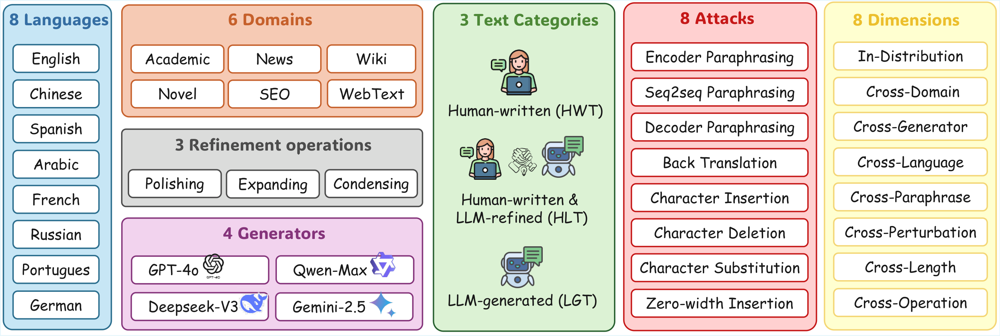

<p align="center">
    
<p>

# DetectRL-X: Towards Reliable Multilingual and Real-World LLM-Generated Text Detection

<div align="center">

[](https://www.apache.org/licenses/LICENSE-2.0)
[](https://www.2026.aclweb.org/)
[](https://huggingface.co/datasets/WUJUNCHAO/DetectRL-X)

⭐ [_**University of Macau**_](https://www.um.edu.mo) &nbsp; | &nbsp; [_**Alibaba Group**_](https://www.alibaba.com) &nbsp; | &nbsp; [_**Xiamen University**_](https://www.xmu.edu.cn) ⭐

:octocat: [**GitHub**](https://github.com/AIDC-AI/Marco-LLM) &nbsp; 🤗 **Data** (Coming Soon) &nbsp; 📝 [**Paper**](https://arxiv.org/abs/2605.15518)

</div>

## 📖 Introduction

The effective detection and governance of Large Language Model (LLM) generated content has become increasingly critical due to the growing risk of misuse. Despite the impressive performance of existing detectors, their reliability and potential in multilingual, real-world scenarios remain largely underexplored.

**DetectRL-X** is the most large-scale and challenging multilingual benchmark for LLM-generated text (LGT) detection, containing **3.46 million samples** spanning **8 languages**, **6 domains**, **4 generators**, **8 attack strategies**, **4 text-length granularities**, and **3 types of refinement operations**, with **8 evaluation dimensions** comparing **12 detectors**.

We extend the traditional Binary classification task (HWT vs. LGT) to a **Ternary setting** that also identifies human-written & LLM-refined text (HLT), better reflecting real-world human-LLM collaboration. The benchmark reveals the strengths and limitations of current state-of-the-art detectors when applied to diverse linguistic resources, and provides a multilingual data augmentation framework for building adversarial benchmarks.

## 🔭 Benchmark Overview

<p align="center">
  
</p>

DetectRL-X evaluates detectors in a realistic, multilingual setting by combining human-written texts, LLM-generated texts, AI-refined texts, and attacked texts through multilingual paraphrasing and perturbation strategies.

### Comparison with Existing Benchmarks

DetectRL-X is the first benchmark to simultaneously support **Binary & Ternary classification** in a fully **multilingual** setting with balanced domain and generator distributions, as summarized in Table 1 of the paper.

| Benchmark | Size | Task | | Real-World | | | | | |       Multilingual       | | | |
|:---|:---:|:---:|:---:|:---:|:---:|:---:|:---:|:--:|:---:|:------------:|:---:|:---:|:---:|
| | | Binary | Ternary | Multi-Domain | Multi-Generator | Paraphrase Attack | Perturbation Attack | Multi-Length | Multi-Operation | Language Num | Domain Balance? | Generator Balance? | Multilingual Attacks? |
| TuringBench | 168K | ✓ | ✗ | ✓ | ✓ | ✗ | ✗ | ✗ | ✗ |      1       | ✗ | ✗ | ✗ |
| HC3 | 125K | ✓ | ✗ | ✓ | ✓ | ✗ | ✗ | ✗ | ✗ |      2       | ✗ | ✗ | ✗ |
| MGTBench | 21K | ✓ | ✗ | ✗ | ✓ | ✓ | ✓ | ✓ | ✗ |      1       | ✗ | ✗ | ✗ |
| MULTITuDE | 74K | ✓ | ✗ | ✗ | ✓ | ✗ | ✓ | ✗ | ✗ |      11      | ✗ | ✓ | ✗ |
| M4 | 245K | ✓ | ✗ | ✓ | ✓ | ✗ | ✗ | ✓ | ✗ |      7       | ✗ | ✗ | ✗ |
| MAGE | 448K | ✓ | ✗ | ✓ | ✓ | ✓ | ✗ | ✓ | ✗ |      1       | ✗ | ✗ | ✗ |
| RAID | 6,287K | ✓ | ✗ | ✓ | ✓ | ✓ | ✓ | ✗ | ✗ |      1       | ✗ | ✗ | ✗ |
| Stumbling Blocks | 10K | ✓ | ✗ | ✗ | ✓ | ✓ | ✓ | ✗ | ✗ |      1       | ✗ | ✓ | ✗ |
| DetectRL | 235K | ✓ | ✗ | ✓ | ✓ | ✓ | ✓ | ✓ | ✗ |      1       | ✗ | ✗ | ✗ |
| **DetectRL-X (Ours)** | **3,456K** | **✓** | **✓** | **✓** | **✓** | **✓** | **✓** | **✓** | **✓** |    **8**     | **✓** | **✓** | **✓** |

## ✨ Key Features

### Language Coverage (8 Languages)

Spanning **5 language families** with 3 complexity levels based on morphological richness:

| Complexity | Languages | Families |
|:---|:---|:---|
| **High** | Arabic, Russian, Chinese | Semitic, Slavic, Sino-Tibetan |
| **Medium** | German, French, Spanish, Portuguese | Germanic, Romance |
| **Low** | English | Germanic |

### Domain Coverage (6 Domains)

Human-written texts are curated from domains highly susceptible to LLM misuse:

| Domain | Description |
|:---|:---|
| Academic | Scholarly writing and research papers |
| News | Journalistic reporting and articles |
| Novel | Creative fiction and literary works |
| SEO | Search engine optimization content and marketing copy |
| Wiki | Wikipedia-style encyclopedic entries |
| WebText | General web content from diverse online sources |

All texts are collected exclusively from publicly available internet sources published prior to 2022 to ensure authenticity.

### Generators (4 Commercial LLMs)

Texts are generated using 4 mainstream multilingual LLMs:

| Generator | Description |
|:---|:---|
| Deepseek-V3 | Latest large-scale MoE language model |
| Gemini-2.5-flash | Google's high-performance multilingual model |
| GPT-4o | OpenAI's flagship multimodal model |
| Qwen-Max | Alibaba's advanced multilingual LLM |

### Text Refinement Operations (3 Types)

Reflecting real-world human-LLM collaboration, we define three refinement operations based on established writing taxonomies:

1. **Polishing**: Improving fluency and style
2. **Expanding**: Adding details and elaboration
3. **Condensing**: Removing redundancies

These operations define three text categories:
- **HWT** (Human-Written Text): Original human-authored content
- **HLT** (Human-written & LLM-refined Text): HWT refined by LLM
- **LGT** (LLM-Generated Text): Fully LLM-generated content

### Attack Framework (8 Strategies)

A multilingual attack framework simulates diverse human modifications and writing noise:

**Paraphrase Attacks** (semantic-preserving transformations):
- Encoder Paraphrasing (EP)
- Seq2seq Paraphrasing (SP)
- Decoder Paraphrasing (DP)
- Back-Translation (BT)

**Perturbation Attacks** (fine-grained character-level noise):
- Character Insertion (CI)
- Character Substitution (CS)
- Character Deletion (CD)
- Zero-width Insertion (ZI)

### Text Length Granularities (4 Levels)

Semantically complete sub-samples at **64, 128, 256, and 512 tokens** to assess length sensitivity.

### Evaluation Dimensions (8 Dimensions)

| Dimension | Description |
|:---|:---|
| **In-Distribution** | Mixed distribution across all languages, domains, and generators |
| **Cross-Domain** | Generalization to unseen domains |
| **Cross-Generator** | Generalization to unseen generators |
| **Cross-Language** | Generalization to unseen languages |
| **Cross-Paraphrase** | Robustness against 4 paraphrase attacks |
| **Cross-Perturbation** | Robustness against 4 perturbation attacks |
| **Cross-Length** | Robustness to 4 text length granularities |
| **Cross-Operation** | Robustness to 3 text refinement operations |

### Evaluation Metrics

- **Best F1 Score (F<sub>1</sub><sup>B</sup>)**: Optimal balance between precision and recall, with threshold determined by maximizing Youden's J statistic
- **F1 at FPR=0.01 (F<sub>1</sub><sup>F</sup>)**: F1 score at a fixed low false positive rate (0.01), reflecting reliability in minimal-tolerance scenarios

## 🛡️ Evaluated Detectors (12 Methods)

We benchmark 12 representative detectors covering both statistical and neural-based approaches:

**Statistical-based Methods** (9):
Log-Likelihood, Log-Rank, DetectLLM-LRR, GECScore, ReviseDetect, Fast-DetectGPT, Binoculars, Lastde++, RepreGuard

**Neural-based Methods** (3):
XLM-RoBERTa-Classifier (X-Rob-Classifier), mDeBERTa-Classifier, Biscope

### Main Results

| # | Finding                                                                                                                                                                                                                                                                                                                                                                     |
|:---|:----------------------------------------------------------------------------------------------------------------------------------------------------------------------------------------------------------------------------------------------------------------------------------------------------------------------------------------------------------------------------|
| 1 | **Neural > Statistical**: Neural-based detectors consistently outperform statistical-based detectors. XLM-RoBERTa-Classifier ranks **1st** on the Binary leaderboard (avg F<sub>1</sub><sup>B</sup> **95.58%**, F<sub>1</sub><sup>F</sup> **91.31%**), while mDeBERTa-Classifier leads Ternary (F<sub>1</sub><sup>B</sup> **87.68%**, F<sub>1</sub><sup>F</sup> **81.10%**) |
| 2 | **Limitations of Statistical Methods**: Even in In-Distribution, statistical-based detectors average only F<sub>1</sub><sup>B</sup> **67.89%**, with the best (GECScore) reaching **83.22%**, indicating poor robustness to real-world heterogeneity                                                                                                                        |
| 3 | **Cross-Lingual Challenge**: Neural-based detectors drop F<sub>1</sub><sup>B</sup> from 95.3% → 91.4% (↓3.9%) in Binary and 87.10% → 66.28% (↓**20.82%**) in Ternary cross-lingual settings. Statistical methods show smaller but more variable degradation                                                                                                                 |
| 4 | **Cross-Domain > Cross-Generator**: Cross-Domain is substantially harder. Neural detectors drop **2.95%** in Binary cross-domain vs only **0.78%** in cross-generator. In Ternary, mDeBERTa-Classifier drops **18.2%** cross-domain vs **4.9%** cross-generator                                                                                                             |
| 5 | **Paraphrase & Perturbation Vulnerability**: Paraphrase attacks inflict the most damage — neural F<sub>1</sub><sup>B</sup> drops **28.1%** (Binary) and **16.8%** (Ternary). Perturbation attacks cause **13.1%** (Binary) and **4.3%** (Ternary) drops. Statistical detectors suffer even more (25–40%)                                                                    |
| 6 | **Length & Operation Sensitivity**: In Binary, neural F<sub>1</sub><sup>B</sup> drops ~4.5% (cross-length) and ~1% (cross-operation). In Ternary, declines reach **11.9%** and **13.4%**, with statistical methods dropping **35–40%** in both tasks                                                                                                                        |
| 7 | **Ternary Difficulty**: Ternary is inherently harder — statistical F<sub>1</sub><sup>B</sup> drops from 67.9% → 39.3% (↓**28.6%**), neural from 97.6% → 87.1% (↓**10.5%**). Overall average: statistical ↓23.0%, neural ↓13.7%                                                                                                                                              |
| 8 | **Low-FPR Usability Gap**: Many detectors achieve high F<sub>1</sub><sup>B</sup> but drop sharply in F<sub>1</sub><sup>F</sup>. For example, GECScore declines **12.7%** and Binoculars **14.0%** under strict FPR=0.01 constraints                                                                                                                                         |

### Analysis across Languages

| # | Finding |
|:---|:---|
| 9 | **Complexity Has Minimal Impact**: Language complexity affects detection only within **±3%** — high (81.9%), medium (83.5%), and low (80.5%) complexity languages show comparable Binary F<sub>1</sub><sup>B</sup>. No clear correlation between linguistic complexity and detection performance |
| 10 | **Best/Worst per Language**: Detectors perform best on **Arabic** (Binary/Ternary F<sub>1</sub><sup>B</sup>: 85.6%/63.4%) and worst on **Russian** (80.5%/53.6%), despite both being high-complexity languages |
| 11 | **Cross-Domain Language Sensitivity**: Domain variation significantly amplifies sensitivity in Ternary, with cross-domain drops widening from ~5% to larger gaps across languages. Formal vs informal domains show particularly divergent results |
| 12 | **Attack Robustness by Language**: Mean F<sub>1</sub><sup>B</sup> varies across languages under attacks. Paraphrase consistently degrades performance across all languages, with semantic-preserving transformations being the most challenging |
| 13 | **Length Benefits Complex Languages**: Longer text improves detection — the performance gap between complex and simple languages narrows as token count increases from 64 to 512 |
| 14 | **Refinement Varies by Language**: Cross-operation analysis reveals significant **language-dependent** variation, with complex languages showing greater sensitivity to refinement operations (polishing, expanding, condensing) |

## 📊 Dataset Statistics

The DetectRL-X dataset comprises **3,456,000 samples** with a 2:1 train-test split, balanced across all languages, domains, and generators.

| Category | Subcategory | Samples |
|:---|:---|:---:|
| **Original Samples** | Human-written (HWT) | 144,000 |
| | LLM-generated (LGT) | 144,000 |
| **LLM-refined Samples** | Human + Polishing | 144,000 |
| *(Various Operation Behaviour)* | Human + Expanding | 144,000 |
| | Human + Condensing | 144,000 |
| | LLM + Polishing | 144,000 |
| | LLM + Expanding | 144,000 |
| | LLM + Condensing | 144,000 |
| **Paraphrasing Attacks** | Encoder Paraphrasing | 144,000 |
| | Seq2seq Paraphrasing | 144,000 |
| | Decoder Paraphrasing | 144,000 |
| | Back-Translation | 144,000 |
| **Perturbation Attacks** | Character Insertion | 144,000 |
| | Character Substitution | 144,000 |
| | Character Deletion | 144,000 |
| | Zero-width Insertion | 144,000 |
| **Multi-length Samples** | 64 / 128 / 256 / 512 tokens | 1,152,000 |
| **Total** | | **3,456,000** |

The dataset is organized as follows:
- **Original samples**: 288K samples for human-LLM comparison, balanced across 8 languages, 6 domains, and 4 generators
- **LLM-refined samples**: 864K samples covering 3 operations applied to both HWT and LGT, reflecting real-world human-LLM collaboration
- **Attack samples**: 576K paraphrase + 576K perturbation = 1,152K samples for adversarial stress testing
- **Multi-length samples**: 1,152K samples across 4 length granularities to assess length sensitivity

## 📥 Dataset Access

> ⚠️ Code and data are currently being organized — **Coming Soon**.

```bash
# HuggingFace
https://huggingface.co/datasets/WUJUNCHAO/DetectRL-X
```

## 📧 Contact

For questions or suggestions, please contact us:
- nlp2ct.junchao@gmail.com

## 📄 License

This dataset is licensed under the [Apache License 2.0](https://www.apache.org/licenses/LICENSE-2.0). Usage is strictly restricted to non-commercial academic research purposes.

## 🙏 Acknowledgments

Special thanks to all contributors, annotators, and translators who participated in dataset construction and validation. This project is supported by Alibaba Group, University of Macau, and Xiamen University.

## 📝 Citation

```bibtex
@inproceedings{detectrl-x,
  title     = {DetectRL-X: Towards Reliable Multilingual and Real-World LLM-Generated Text Detection},
  author    = {Junchao Wu and Yefeng Liu and Chenyu Zhu and Hao Zhang and Zeyu Wu and Tianqi Shi and Yichao Du and Longyue Wang and Weihua Luo and Jinsong Su and Derek F. Wong},
  booktitle = {Proceedings of the 63rd Annual Meeting of the Association for Computational Linguistics (Volume 1: Long Papers)},
  year      = {2026},
  url       = {https://arxiv.org/abs/2605.15518},
}
```