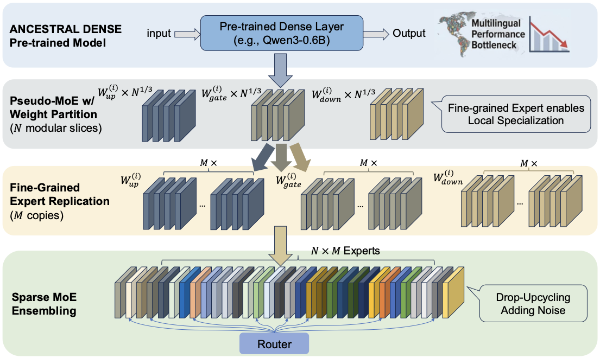
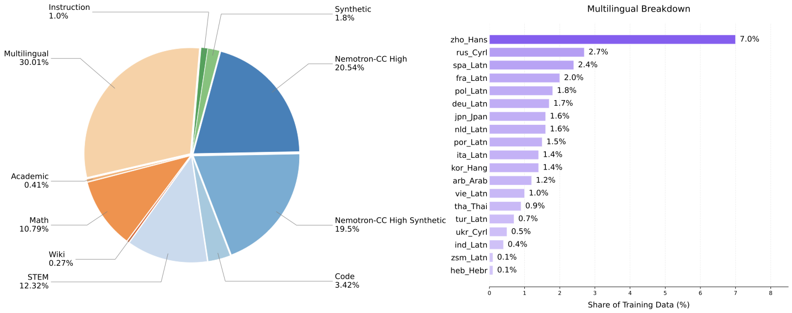
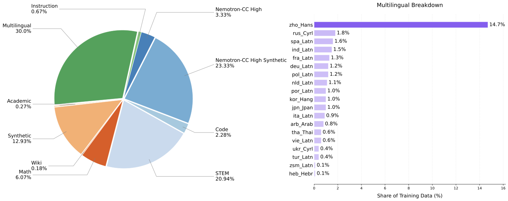
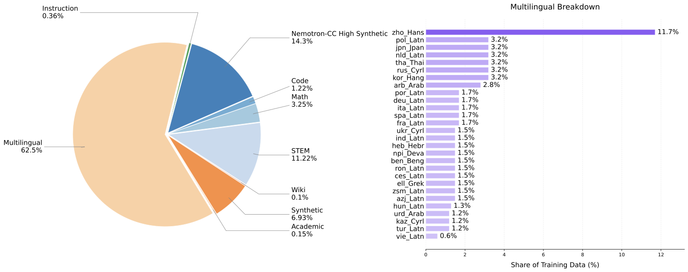
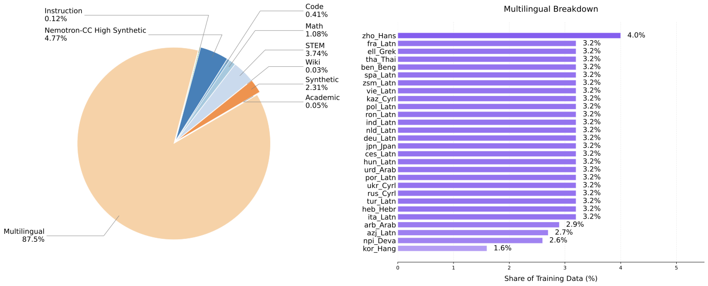
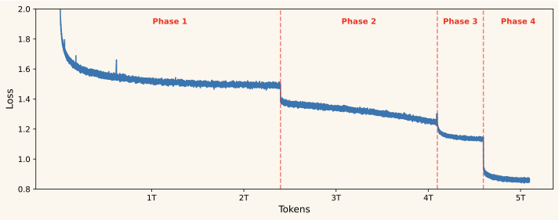
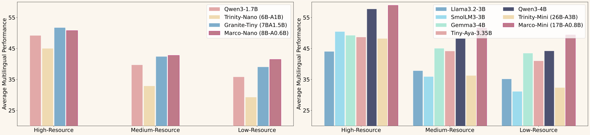
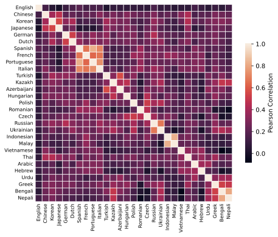
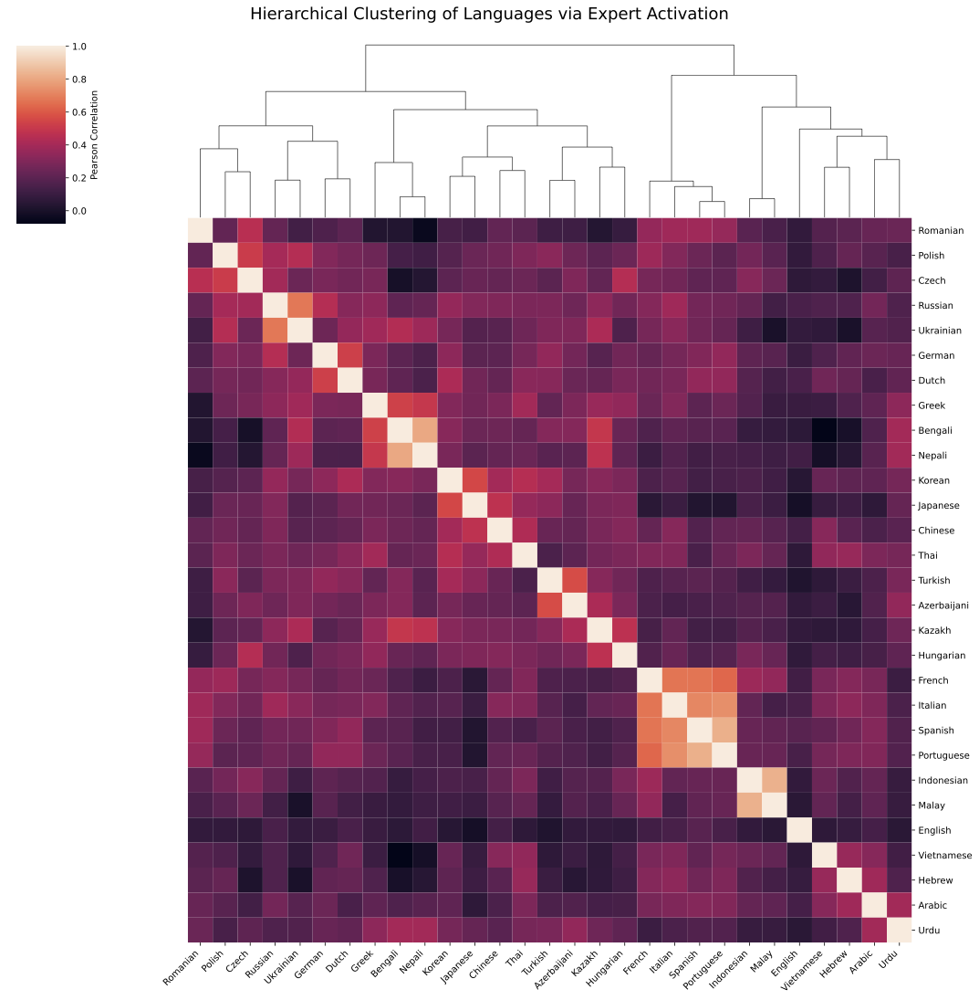

<p align="center">
    
<p>

<h1 align="center">Marco-MoE: Open Multilingual Mixture-of-Expert Language Models with Efficient Upcycling</h1>

<p align="center">
  <b>Alibaba International Digital Commerce</b>
</p>

> 🏠 Back to **[Marco-LLM Overview](../README.md)**

---

## TL;DR

**Marco-MoE** is a family of compact, highly sparse Mixture-of-Experts (MoE) multilingual language models that achieve state-of-the-art performance-to-compute ratios across both English and multilingual benchmarks. By upcycling a dense Qwen3-0.6B-Base model into fine-grained MoE architectures, Marco-MoE covers **29 to 64 languages** while activating only **5-7.5% of total parameters** per token, trained on **5.1 trillion tokens** with a fully open and transparent recipe. Our **Marco-Instruct** variants further surpass models with **3-14x more activated parameters** through a cascaded on-policy distillation pipeline.

<p align="center">
  
  
</p>
<p align="center"><i>
  <b>Left:</b> Marco-MoE models achieve higher multilingual performance for less training compute, establishing a new Pareto frontier.
  <b>Right:</b> Marco-MoE excels in both English and multilingual capabilities simultaneously.
</i></p>

---

## Key Highlights

- **First Sparse Multilingual Upcycling**: The first work to leverage MoE upcycling specifically for multilingual performance in compact model sizes, significantly reducing computational overhead while enhancing model capacity.
- **Fine-Grained Expert Specialization**: Instead of conventional coarse-grained FFN replication, Marco-MoE uses sub-matrix splitting to initialize a large number of fine-grained experts, combined with Drop-Upcycling to catalyze specialized expert convergence.
- **Full Transparency and Openness**: All pre-training datasets, data synthesis methodologies, and the four-stage pre-training curriculum are fully disclosed. Models, data, and training recipes are open-sourced.
- **Superior Efficiency**: Marco-Mini-Base (0.86B activated / 17.3B total params) matches or outperforms Qwen3-4B-Base (4B activated) while using **5.5x fewer training FLOPs**.
- **Strong Instruct Models**: Marco-Mini-Instruct achieves **75.5 avg** on English and **71.0 avg** on cultural/regional benchmarks, surpassing Qwen3-4B-Instruct (73.3 / 69.1) and models with 3-14x more activated parameters.

---

## Model Architecture

Marco-MoE uses a decoder-only Transformer with sparse MoE layers replacing standard FFN layers. Key architectural features include Grouped-Query Attention (GQA), RMSNorm, SwiGLU activation, and Rotary Positional Embeddings (RoPE).

| Configuration | Marco-Nano | Marco-Mini |
|:---|:---:|:---:|
| Total Parameters | 8B | 17.3B |
| Activated Parameters | 0.6B | 0.86B |
| Active Ratio | 7.5% | 5% |
| Num Layers | 28 | 28 |
| Model Dimension | 1024 | 1024 |
| FFN Intermediate Dimension | 3072 | 3072 |
| Expert Dimension | 384 | 768 |
| Total Experts | 232 | 256 |
| Activated Experts (per token) | 8 | 8 |
| Q-heads / KV-heads | 16 / 8 | 16 / 8 |
| Head Dimension | 128 | 128 |
| Upcycled From | Qwen3-0.6B-Base | Qwen3-0.6B-Base |

### Model Release

| Model | Type | Total Params | Active Params | Languages | HuggingFace |
|:---|:---:|:---:|:---:|:---:|:---:|
| Marco-Nano-Base | Base | 8B | 0.6B | 29 | 🤗 [AIDC-AI/Marco-Nano-Base](https://huggingface.co/AIDC-AI/Marco-Nano-Base) |
| Marco-Mini-Base | Base | 17.3B | 0.86B | 29 | 🤗 [AIDC-AI/Marco-Mini-Base](https://huggingface.co/AIDC-AI/Marco-Mini-Base) |
| Marco-Mini-Global-Base | Base | 17.3B | 0.86B | 64 | 🤗 [AIDC-AI/Marco-Mini-Global-Base](https://huggingface.co/AIDC-AI/Marco-Mini-Global-Base) |
| Marco-Nano-Instruct | Instruct | 8B | 0.6B | 29 | 🤗 [AIDC-AI/Marco-Nano-Instruct](https://huggingface.co/AIDC-AI/Marco-Nano-Instruct) |
| Marco-Mini-Instruct | Instruct | 17.3B | 0.86B | 29 | 🤗 [AIDC-AI/Marco-Mini-Instruct](https://huggingface.co/AIDC-AI/Marco-Mini-Instruct) |

All models are upcycled from [Qwen3-0.6B-Base](https://huggingface.co/Qwen/Qwen3-0.6B-Base) and released under the [Apache License 2.0](https://www.apache.org/licenses/LICENSE-2.0).

---

## Upcycling Method: Fine-Grained Drop-Upcycling

Marco-MoE introduces a novel fine-grained upcycling approach that converts a pre-trained dense model into a sparse MoE:

1. **Sub-Matrix Splitting**: The dense FFN weight matrices are partitioned into *N* slices along the intermediate dimension, where each slice initializes a fine-grained expert.
2. **Weight Scaling**: A scaling factor of $\lambda = N^{(1/3)}$ is applied to expert weights to correct the magnitude mismatch between dense (unit coefficients) and MoE (softmax-normalized) outputs.
3. **Drop-Upcycling**: Random weight indices in each expert are dropped and re-initialized with a Gaussian distribution (using the dropped weights' statistics), promoting expert diversification and preventing identical initializations from blocking specialization.

<p align="center">
  
</p>
<p align="center"><i>Overview of the fine-grained Drop-Upcycling method for converting dense models to MoE models.</i></p>

<!-- The ablation below shows that upcycling significantly accelerates pre-training convergence compared to training from scratch, and that weight scaling reduces loss spikes for more stable training:

<p align="center">
  
</p>
<p align="center"><i>Ablation on weight scaling and upcycling (0.8B active, 17B total parameters, 100B tokens).</i></p> -->

---

## Pre-Training

### Language Coverage

Marco-MoE initially covers **29 languages**: English, Chinese, Arabic, German, Spanish, French, Korean, Japanese, Portuguese, Turkish, Indonesian, Italian, Dutch, Polish, Russian, Vietnamese, Thai, Bengali, Czech, Hebrew, Ukrainian, Malay, Urdu, Kazakh, Greek, Romanian, Hungarian, Nepali, and Azerbaijani.

### Data Sources

- **High-Quality English**: Nemotron-CC-v2 (High and High-Synthetic partitions), internal web-crawled corpus (FineWeb-EDU filtered), diverse QA pairs
- **Reasoning & Instruction**: Nemotron datasets, FineMath, MegaMath, OpenThoughts3, FLAN
- **Multilingual Web**: FineWeb-2 and FineWeb2-HQ with rephrasing strategies for low-quality languages
- **Synthetic Data**:
  - *Multilingual QA*: Translated Diverse QA dataset (+1.4% avg for low-resource languages)
  - *Multilingual STEM*: Translation-based synthesis from English STEM corpora (+8% avg gain)
  - *Cultural/Regional*: LLM-based filtering and hierarchical expansion for cultural MCQs

### Four-Stage Training Curriculum (5.1T Tokens)

The pre-training follows a carefully designed four-stage curriculum:

| Stage | Token Range | Key Changes |
|:---:|:---:|:---|
| 1 | 0 - 2.4T | 19 languages; high-quality English, reasoning, instruction, multilingual web & QA |
| 2 | 2.4T - 4.1T | Upsample reasoning & Chinese; downsample English web |
| 3 | 4.1T - 4.6T | Add 9 new languages (Bengali, Czech, Urdu, Kazakh, Greek, Romanian, Hungarian, Nepali, Azerbaijani); upsample medium-resource languages |
| 4 | 4.6T - 5.1T | Decay English/reasoning/instruction; integrate curated synthetic multilingual data |

### Data Mixtures by Phase

<p align="center">
  
  
</p>
<p align="center">
  
  
</p>
<p align="center"><i>Data mixture distributions across the four pre-training phases.</i></p>

### Pre-Training Loss

<p align="center">
  
</p>
<p align="center"><i>Pre-training loss curves for Marco-Mini.</i></p>

---

### Main Results

#### English Performance

Marco-Mini-Base achieves **63.7 average** across 15 English benchmarks (best overall), surpassing Qwen3-4B-Base (63.3) while using **5.5x fewer FLOPs** (1.56 x 10^23 vs 8.64 x 10^23). Marco-Nano-Base reaches **57.5 average** with only 0.6B activated parameters, outperforming Llama3.2-3B (53.7) and Gemma3-4B (57.2).

#### Multilingual General Performance

Marco-Mini-Base scores **50.9 average** across 11 multilingual benchmarks (best overall), outperforming Qwen3-4B (48.3) by 2.6 points. Highlights include:
- GlobalMMLU: **64.2** (vs 61.6 for Qwen3-4B)
- MMMLU: **62.0** (vs 59.3)
- MGSM: **75.6** (vs 76.0)
- FLORES-200 En-Xx: **32.3** (vs 25.4)

#### Cultural & Regional Performance

Marco-Mini-Base achieves **65.0 average** across 11 cultural/regional benchmarks, highly competitive with Qwen3-4B-Base (65.6):
- Global-PIQA: **72.3** (best)
- TurkishMMLU: **62.7** (best)
- GreekMMLU: **70.3** (best)
- KazakhMMLU: **62.6** (best)

#### Performance by Geographic Region

<p align="center">
  
</p>
<p align="center"><i>Marco-MoE demonstrates substantial performance gains in West Asia and South Asia regions, showing superior adaptation to linguistically diverse clusters.</i></p>

#### Performance by Resource Level

<p align="center">
  
</p>
<p align="center"><i>Marco-MoE shows the largest gains over baselines in long-tail and low-resource languages where capacity bottlenecks are most acute.</i></p>

---

### Analysis: Expert Specialization

Marco-MoE's experts develop meaningful linguistic specialization. By analyzing "Language-Expert Signatures" (the proportion of each language's tokens routed to each expert per layer), the paper reveals that expert activation patterns cluster along linguistic family lines:

<p align="center">
  
  
</p>
<p align="center"><i>
  <b>Left:</b> Pearson correlation of expert activation patterns between languages.
  <b>Right:</b> Hierarchical clustering dendrogram based on expert activation signatures.
</i></p>

**Key findings:**
- **Romance languages** (Spanish, French, Portuguese, Italian) share common expert pools
- **Slavic languages** (Russian, Ukrainian) and **Austronesian languages** (Indonesian, Malay) form tight clusters
- **Indic languages** (Bengali, Nepali) also cluster together
- **Linguistically isolated languages** (Thai, Vietnamese, Arabic, Hebrew) exhibit low correlations with others
- **English** remains relatively isolated, suggesting it occupies dedicated high-capacity expert pools

---

### Scaling to 64 Languages

**Marco-Mini-Global-Base** extends coverage to **64 languages** by training on an additional 1.4T tokens. The 35 newly added languages span diverse families and regions: Danish, Swedish, Norwegian, Catalan, Galician, Welsh, Irish, Basque, Croatian, Latvian, Lithuanian, Slovak, Slovenian, Estonian, Finnish, Serbian, Bulgarian, Persian, Maltese, Hindi, Marathi, Gujarati, Punjabi, Tamil, Telugu, Tagalog, Javanese, Khmer, Lao, Burmese, Amharic, Swahili, Yoruba, Igbo, and Zulu.

Key results:
- **Preserves English proficiency** (63.6 avg, virtually unchanged)
- **Increases multilingual advantage** over Qwen3-4B from 2.6% to 3.6%
- Demonstrates the MoE architecture's inherent scalability for language expansion without performance degradation

---

## Post-Training

### Supervised Fine-Tuning (SFT)

The SFT stage uses four data categories:
1. **General Instructions**: Dolci-Instruct dataset with Nemotron augmentations
2. **Knowledge-Intensive Scientific Data**: Scientific prompts with Gemini3-Flash distilled responses
3. **Translation Data**: NLLB parallel corpora with multi-stage heuristic + semantic filtering (Qwen3-Embedding-8B for relevance scoring)
4. **Multilingual & Cultural Data**: Wikidata-sourced entity descriptions with back-translation and knowledge augmentation via Gemini3-Flash

### On-Policy Distillation (OPD)

OPD bridges on-policy learning (training on model's own generations) with off-policy supervision (dense per-token teacher signals), addressing both distribution shift and sample inefficiency.

**Data Sources:**
- **Instruction Following**: Nemotron-RL datasets (including structured outputs)
- **Knowledge & Reasoning**: Nemotron-RL-ReasoningGym-v1, Nemotron-RL-knowledge-mcqa
- **Alignment**: Nemotron-Cascade-RL-RLHF
- **Math**: DAPO-Math-17k, Skywork-OR1-RL-Data
- **Multilingual**: Curated translation + cultural data + Nemotron-SFT-Multilingual-v1

**Cascaded Distillation Strategy:**

OPD is implemented in the SLIME framework with a cascaded distillation approach that progressively transfers knowledge from increasingly stronger teachers:

| Phase | Teacher Model | Marco-Nano Steps | Marco-Mini Steps |
|:---:|:---|:---:|:---:|
| 1 | [Qwen3-30B-A3B-Instruct-2507](https://huggingface.co/Qwen/Qwen3-30B-A3B-Instruct-2507) | ~1,900 | ~1,900 |
| 2 | [Qwen3-Next-80B-A3B-Instruct](https://huggingface.co/Qwen/Qwen3-Next-80B-A3B-Instruct) | ~1,000 | ~1,900 |

- Learning rate: 1 x 10^-6 (constant), batch size: 512 (2 responses per prompt = 1,024 sequences/step)
- Max prompt/response lengths: 2,048 / 8,192 tokens
- Total training time: ~110 hours on 64 GPUs

### Instruct Model Results

After post-training with SFT and cascaded on-policy distillation, Marco-Instruct models achieve strong performance that surpasses models with significantly more activated parameters.

<p align="center">
  
</p>
<p align="center"><i>Performance comparison of Marco-Instruct models against open-source instruct models of comparable and larger sizes.</i></p>

#### English Performance (Instruct)

Marco-Mini-Instruct achieves **75.5 average** across 7 English benchmarks, surpassing Qwen3-4B-Instruct (73.3), Ministral3-8B-Instruct (70.9), and Gemma3-12B-Instruct (65.8). Marco-Nano-Instruct reaches **62.8 average** with only 0.6B activated parameters, outperforming LFM2-8B-A1B-Instruct (62.5) which has 2.5x more active params.

#### Multilingual General Performance (Instruct)

Marco-Mini-Instruct scores **50.8 average** across 10 multilingual benchmarks, ranking 1st among all models. It outperforms LFM2-24B-A2B-Instruct (36.9) by 13.9 points despite having 38% fewer total parameters. Highlights include:
- GlobalMMLU: **73.3** (vs 70.2 for Qwen3-4B-Instruct)
- MGSM: **87.4** (vs 84.4)
- PolyMath: **44.7** (vs 47.2)

#### Cultural & Regional Performance (Instruct)

Marco-Mini-Instruct achieves **71.0 average** across 11 cultural/regional benchmarks, outperforming Qwen3-4B-Instruct (69.1) and Gemma3-12B-Instruct (67.7):
- Global-PIQA: **84.2** (best)
- TurkishMMLU: **74.7** (best)
- KazakhMMLU: **68.8** (best)
- CMMLU: **75.3** (vs 78.6 for Qwen3-4B-Instruct)

---

## Citation

```bibtex
@article{marco-moe,
  title={Marco-MoE: Open Multilingual Mixture-of-Expert Language Models with Efficient Upcycling},
  author={Fan Jiang, Yu Zhao, Chenyang Lyu, Tianqi Shi, Yichao Du, Feihu Jiang, Longyue Wang and Weihua Luo},
  year={2026}
}
```
