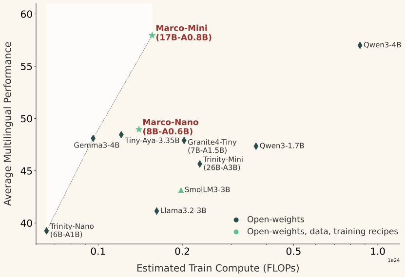
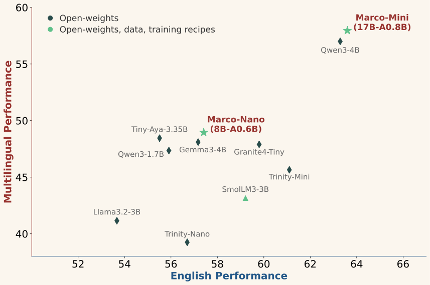
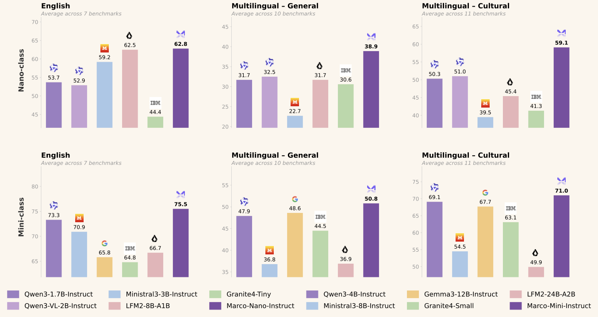
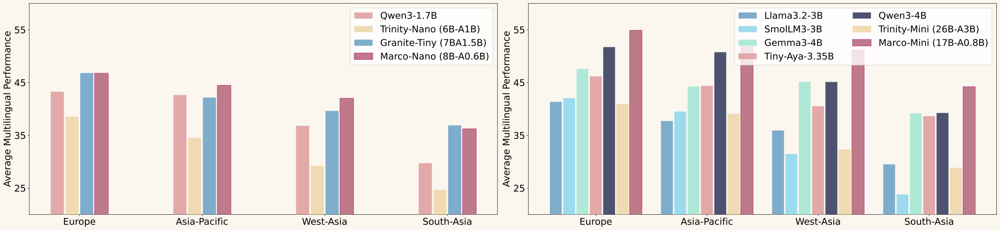

<p align="center">
    
<p>

# Marco-LLM: Towards Multilingual and Multiculture Large Language Models

<h4 align="center">

<div align="center">


</h4>

<div align="center">

⭐[_**Alibaba International Digital Commerce**_](https://aidc-ai.com)⭐

:octocat: [**GitHub**](https://github.com/AIDC-AI/Marco-LLM) &nbsp; 🤗 [**Model**](https://huggingface.co/collections/AIDC-AI/marco-moe) &nbsp; 📝 [**Marco-MoE Paper**](https://huggingface.co/AIDC-AI/Marco-Nano-Instruct/blob/main/technical_details.pdf) &nbsp; 📝 [**Marco-Bench-MIF Paper**](https://aclanthology.org/2025.acl-long.1172)

</div>

#

**Marco-LLM** is a research initiative from Alibaba International Digital Commerce dedicated to building multilingual and multicultural large language models. Our work spans efficient multilingual model architectures and rigorous evaluation benchmarks, with the goal of delivering strong performance across diverse languages and cultures — especially for underserved and low-resource communities.

## 🔥 News

- **[2026.4]** 🔥 We released **[CulturAll](./CulturAll/README.md)** — a comprehensive benchmark for evaluating LLMs' multilingual and multicultural competence on grounded tasks, covering **14 languages**, **51 regions**, and **16 topics** with 2,610 samples.

- **[2026.4]** 🔥 We released **[Marco-MoE](./Marco-MoE/README.md)** — a family of compact, highly sparse multilingual Mixture-of-Expert language models. Marco-MoE achieves state-of-the-art performance-to-compute ratios across both English and multilingual benchmarks, covering **29 to 64 languages** while activating only **5-7.5%** of total parameters per token. Models, data, and training recipes are fully open-sourced.

- **[2025.5]** 🔥 The paper **[Marco-Bench-MIF](./Marco-Bench-MIF/README.md)** has been accepted by **ACL 2025** — the first deeply localized multilingual instruction-following benchmark across 30 languages, revealing that machine translation underestimates model performance by 7-22%.

#

## Marco-MoE: Open Multilingual MoE LLMs with Efficient Upcycling

> 📄 **[Full Details](./Marco-MoE/README.md)**

Marco-MoE addresses the "curse of multilinguality" — the challenge that expanding language coverage in fixed-parameter models degrades per-language performance. By upcycling a dense Qwen3-0.6B-Base into fine-grained sparse MoE architectures via a novel **Drop-Upcycling** method, Marco-MoE achieves superior multilingual performance at a fraction of the training cost. Marco-Instruct variants further surpass models with **3-14x more activated parameters** through cascaded on-policy distillation.

### Key Highlights

- **First Sparse Multilingual Upcycling**: The first work to leverage MoE upcycling specifically for multilingual performance in compact model sizes.
- **Fine-Grained Expert Specialization**: Sub-matrix splitting initializes hundreds of fine-grained experts, combined with Drop-Upcycling to promote expert diversification — unlike conventional coarse-grained FFN replication.
- **Full Transparency**: Complete pre-training datasets, data synthesis pipelines, and the four-stage training curriculum (5.1T tokens) are fully disclosed and open-sourced.
- **Superior Efficiency**: Marco-Mini-Base (0.86B activated / 17.3B total) matches or outperforms Qwen3-4B-Base (4B activated) while using **5.5x fewer training FLOPs**.
- **Strong Instruct Models**: Marco-Mini-Instruct achieves 75.5 avg (English) and 71.0 avg (cultural/regional), surpassing Qwen3-4B-Instruct and models with 3-14x more activated parameters.

### Model Release

**Base Models:**

| Model | Total Params | Active Params | Active Ratio | Languages | HuggingFace |
|:---|:---:|:---:|:---:|:---:|:---:|
| Marco-Nano-Base | 8B | 0.6B | 7.5% | 29 | 🤗 [AIDC-AI/Marco-Nano-Base](https://huggingface.co/AIDC-AI/Marco-Nano-Base) |
| Marco-Mini-Base | 17.3B | 0.86B | 5% | 29 | 🤗 [AIDC-AI/Marco-Mini-Base](https://huggingface.co/AIDC-AI/Marco-Mini-Base) |
| Marco-Mini-Global-Base | 17.3B | 0.86B | 5% | 64 | 🤗 [AIDC-AI/Marco-Mini-Global-Base](https://huggingface.co/AIDC-AI/Marco-Mini-Global-Base) |

All models are upcycled from [Qwen3-0.6B-Base](https://huggingface.co/Qwen/Qwen3-0.6B-Base).

**Instruct Models:**

| Model | Total Params | Active Params | Languages | HuggingFace |
|:---|:---:|:---:|:---:|:---:|
| Marco-Nano-Instruct | 8B | 0.6B | 29 | 🤗 [AIDC-AI/Marco-Nano-Instruct](https://huggingface.co/AIDC-AI/Marco-Nano-Instruct) |
| Marco-Mini-Instruct | 17.3B | 0.86B | 29 | 🤗 [AIDC-AI/Marco-Mini-Instruct](https://huggingface.co/AIDC-AI/Marco-Mini-Instruct) |

### Performance

<div align="center">
  
  
  <p><i><b>Left:</b> Marco-MoE establishes a new Pareto frontier for multilingual performance vs. training compute. <b>Right:</b> Marco-MoE excels in both English and multilingual capabilities simultaneously.</i></p>
</div>

<p align="center">
  
</p>
<p align="center"><i>Marco-Instruct models achieve strong performance that surpasses models with significantly more activated parameters.</i></p>

**Base Models (Marco-Mini-Base vs. Qwen3-4B-Base):**

| Category | Benchmarks | Marco-Mini-Base | Qwen3-4B-Base | Delta |
|:---|:---:|:---:|:---:|:---:|
| **English** | 15 tasks (MMLU, BBH, GSM8K, ...) | **63.7** | 63.3 | +0.4 |
| **Multilingual General** | 11 tasks (GlobalMMLU, MGSM, FLORES, ...) | **50.9** | 48.3 | +2.6 |
| **Cultural & Regional** | 11 tasks (INCLUDE, TurkishMMLU, ...) | 65.0 | **65.6** | -0.6 |

> Marco-Mini-Base uses **5.5x fewer FLOPs** than Qwen3-4B-Base (1.56 vs 8.64 x 10²³) and activates only **0.86B** of 17.3B total parameters.

**Instruct Models (Marco-Mini-Instruct vs. Qwen3-4B-Instruct):**

| Category | Benchmarks | Marco-Mini-Instruct | Qwen3-4B-Instruct | Delta |
|:---|:---:|:---:|:---:|:---:|
| **English** | 7 tasks (MMLU, MATH, GSM8K, ...) | **75.5** | 73.3 | +2.2 |
| **Multilingual General** | 10 tasks (GlobalMMLU, MGSM, ...) | **50.8** | 47.9 | +2.9 |
| **Cultural & Regional** | 11 tasks (INCLUDE, TurkishMMLU, ...) | **71.0** | 69.1 | +1.9 |

> Marco-Mini-Instruct surpasses models with **3-14x more activated parameters**, including LFM2-24B-A2B-Instruct and Gemma3-12B-Instruct.

<div align="center">
  
  <p><i>Marco-MoE demonstrates the largest gains in <b>West Asia</b> and <b>South Asia</b>, and in <b>low-resource languages</b> where capacity bottlenecks are most acute.</i></p>
</div>

**Scaling to 64 Languages:** Marco-Mini-Global extends to 64 languages (adding 35 new languages) while preserving English proficiency (63.6 avg) and increasing the multilingual advantage over Qwen3-4B from 2.6% to 3.6%.

#

## Marco-Bench-MIF: Multilingual Instruction-Following Benchmark

> 📄 **[Full Details](./Marco-Bench-MIF/README.md)** &nbsp; | &nbsp; 📝 [**Paper**](https://aclanthology.org/2025.acl-long.1172) &nbsp; | &nbsp; 🤗 [**Dataset**](https://huggingface.co/datasets/AIDC-AI/Marco-Bench-MIF) &nbsp; | &nbsp; **ACL 2025**

Marco-Bench-MIF is the first deeply localized multilingual benchmark for evaluating instruction-following capabilities across **30 languages** spanning 6 language families. Unlike benchmarks relying on machine translation, it implements fine-grained cultural adaptations — revealing that machine-translated evaluations underestimate model performance by **7-22%**.

**Key Features:**
- **30 languages** across 6 families, from high-resource (English, Chinese, German) to low-resource (Yoruba, Nepali)
- **Deep cultural localization**: lexical replacement, theme transformation, and pragmatic reconstruction
- **541 instruction-response pairs** covering diverse constraint types
- Evaluated 20+ LLMs: 70B+ models outperform 8B by 45-60%; 25-35% gap between high/low-resource languages

```bash
# Access the dataset
https://huggingface.co/datasets/AIDC-AI/Marco-Bench-MIF
```

## CulturAll: Benchmarking Multilingual and Multicultural Competence of LLMs

> 📄 **[Full Details](./CulturAll/README.md)**

CulturAll is a comprehensive and challenging benchmark to assess LLMs' multilingual and multicultural competence on grounded tasks. It contains **2,610 samples** in **14 languages** across **51 regions** and **16 topics**. The best LLM achieves only **44.48% accuracy**, underscoring substantial room for improvement.

#

## 👨🏻‍💻 Acknowledgement

Special thanks to all contributors, annotators, and translators. This project is supported by Alibaba International Digital Commerce Group.

## Citation

If you find our work useful, please cite the relevant papers:

**Marco-MoE:**
```bibtex
@article{marco-moe,
  title={Marco-MoE: Open Multilingual Mixture-of-Expert Language Models with Efficient Upcycling},
  author={Fan Jiang, Yu Zhao, Chenyang Lyu, Tianqi Shi, YiChao Du, Feihu Jiang, Longyue Wang and Weihua Luo},
  year={2026}
}
```

**Marco-Bench-MIF:**
```bibtex
@inproceedings{zeng-etal-2025-marco,
  title     = "Marco-Bench-{MIF}: On Multilingual Instruction-Following Capability of Large Language",
  author    = "Zeng, Bo and Lyu, Chenyang and Liu, Sinuo and Zeng, Mingyan and Wu, Minghao and Ni, Xuanfan and Shi, Tianqi and Zhao, Yu and Liu, Yefeng and Zhu, Chenyu and Li, Ruizhe and Geng, Jiahui and Li, Qing and Tong, Yu and Wang, Longyue and Luo, Weihua and Zhang, Kaifu",
  editor    = "Che, Wanxiang and Nabende, Joyce and Shutova, Ekaterina and Pilehvar, Mohammad Taher",
  booktitle = "Proceedings of the 63rd Annual Meeting of the Association for Computational Linguistics (Volume 1: Long Papers)",
  month     = jul,
  year      = "2025",
  address   = "Vienna, Austria",
  publisher = "Association for Computational Linguistics",
  url       = "https://aclanthology.org/2025.acl-long.1172/",
  doi       = "10.18653/v1/2025.acl-long.1172",
  pages     = "24058--24072",
  ISBN      = "979-8-89176-251-0"
}
```

**CulturAll:**
```bibtex
@misc{lin2026culturallbenchmarkingmultilingualmulticultural,
      title={CulturALL: Benchmarking Multilingual and Multicultural Competence of LLMs on Grounded Tasks}, 
      author={Peiqin Lin and Chenyang Lyu and Wenjiang Luo and Haotian Ye and Md Mehrab Hossain and Chunlan Ma and Shaoxiong Ji and Younes Samih and Bo Zeng and Fan Jiang and Yuanbin Cao and Dilda Duisenbek and Adrian Neo Sau Xun and Daria Pozdniakova and Liubou Misevich and Nevena Marinković and Ngoc Gia Linh Nguyen and Thi Khanh Linh Do and Sarakmatak Sophy and Baotian Hu and Guanhua Chen and Gongbo Tang and Alham Fikri Aji and Longyue Wang and Weihua Luo},
      year={2026},
      eprint={2604.19262},
      archivePrefix={arXiv},
      primaryClass={cs.CL},
      url={https://arxiv.org/abs/2604.19262}, 
}
```
